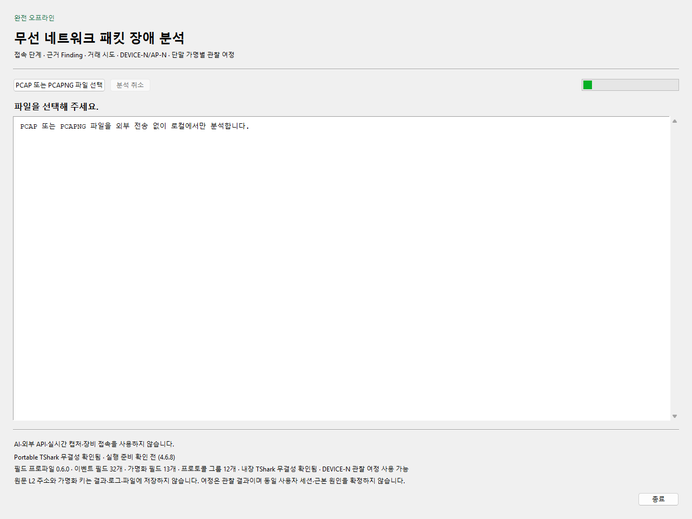
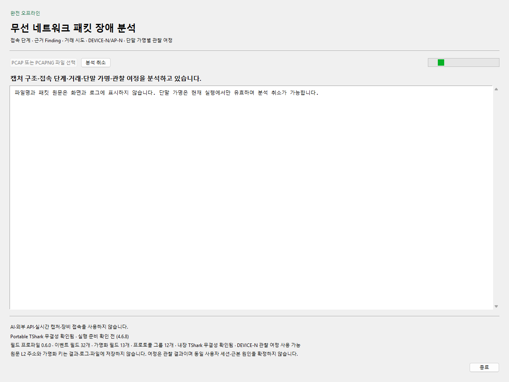
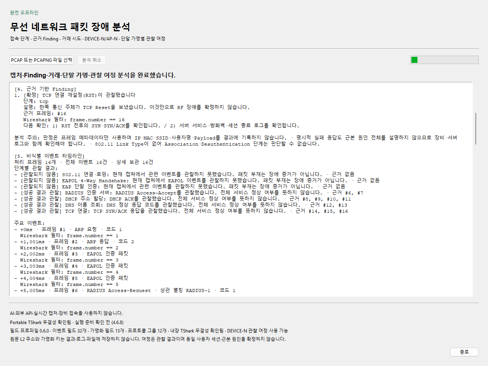
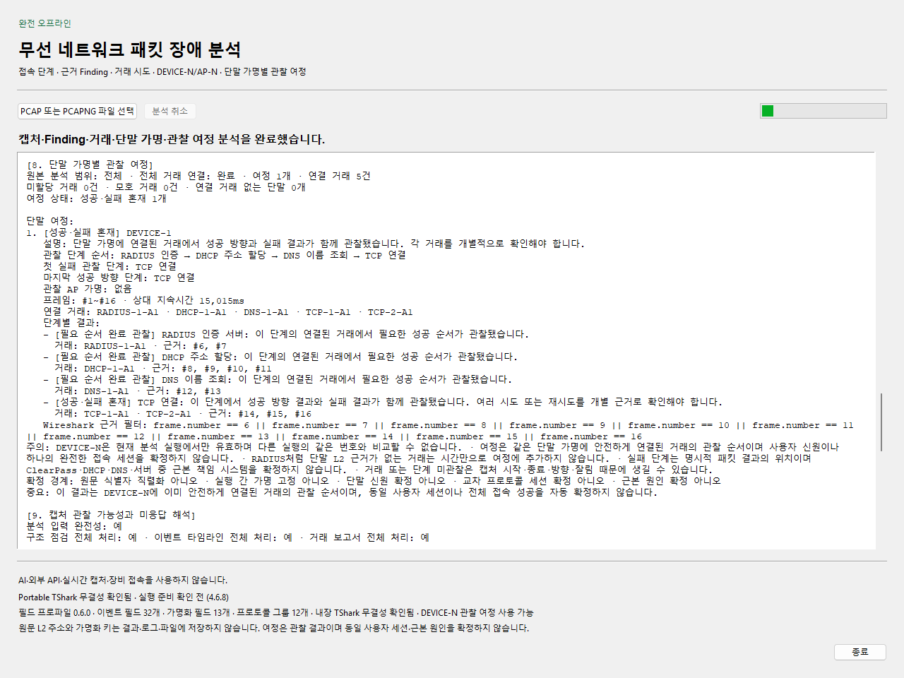
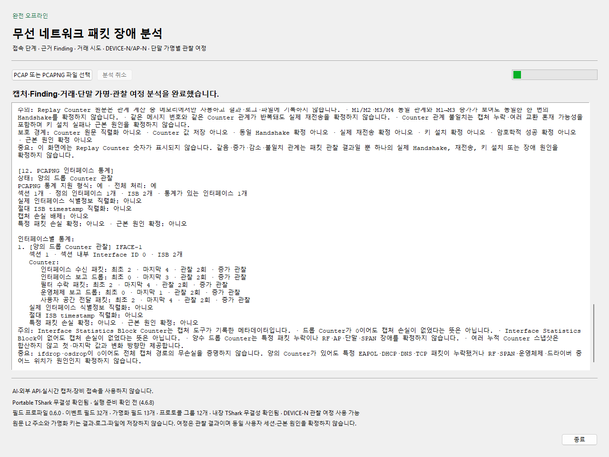
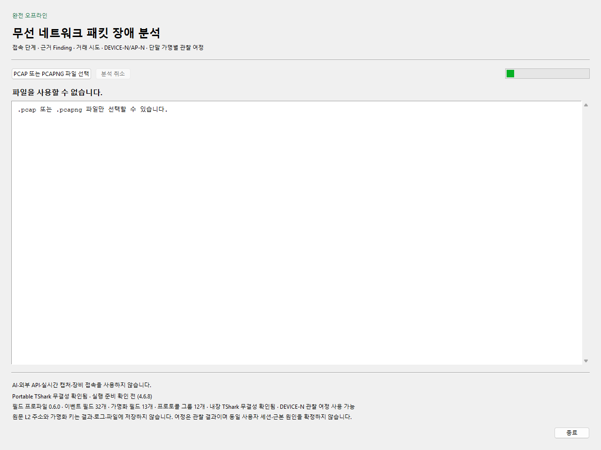

# 화면으로 따라가는 오프라인 패킷 분석

현재 제품의 실제 Tk 창에서 저장소가 생성한 합성 PCAP·PCAPNG를 분석한 Windows 화면입니다. 화면을 별도로 그리거나 분석 결과를 주입하지 않았습니다. 실제 회사 패킷·계정·장비는 사용하지 않았고, 아래 숫자는 합성 파일의 결과입니다.

## 1. 실행 준비



- **행동:** 릴리스 ZIP의 해시를 확인하고 완전히 압축 해제한 뒤 EXE를 실행합니다.
- **읽을 값:** 하단의 Portable TShark 무결성, 필드 프로파일 상태를 확인합니다. 화면의 `실행 준비 확인 전`은 아직 분석을 시작하지 않았다는 뜻입니다.
- **다음 행동:** `PCAP 또는 PCAPNG 파일 선택`에서 분석할 로컬 파일을 고릅니다. 원본 파일은 외부로 전송하지 않습니다.

## 2. 분석 진행과 취소



- **행동:** 분석이 끝날 때까지 기다리거나 `분석 취소`를 누릅니다. 진행 중에는 다른 파일 선택이 비활성화됩니다.
- **읽을 값:** 진행 표시와 상태 문구를 봅니다. 진행 막대를 분석 성공률이나 네트워크 품질로 읽지 않습니다.
- **다음 행동:** 완료 후 먼저 캡처의 Link Type, 처리 범위와 판단 불가 항목을 확인합니다. 아래 결과 화면은 해당 절로 스크롤한 상태입니다.

## 3. 실패 Finding에서 근거 프레임으로



- **행동:** 결과의 `[4. 근거 기반 Finding]`으로 스크롤합니다.
- **읽을 값:** 예시는 16개 프레임 중 **프레임 16의 TCP RST**를 표시합니다. `확정`은 RST 관찰 사실을 가리키며 RF 장애나 서버 책임의 확정이 아닙니다.
- **다음 행동:** `frame.number == 16` 필터와 인접 SYN·SYN/ACK을 Wireshark에서 대조하고, 승인된 장비·서버 로그와 함께 확인합니다. Ethernet 합성 파일에 802.11 Link Type이 없으므로 무선 연결·RF 원인은 판단할 수 없습니다.

## 4. 단말 가명별 관찰 여정



- **행동:** `[8. 단말 가명별 관찰 여정]`에서 단계와 연결 거래를 함께 읽습니다.
- **읽을 값:** 예시는 `DEVICE-1`, 연결 거래 5건, 성공·실패 혼재 1개입니다. DEVICE 번호는 현재 분석에만 유효하며 실제 사용자 신원이나 완전한 접속 세션을 뜻하지 않습니다.
- **다음 행동:** 요약만으로 성공을 단정하지 말고 각 거래의 프레임 필터를 확인합니다. 현재 알려진 TCP·DNS 상관 정확도 제한은 [재현 조건과 적용 범위](PORTFOLIO_KO.md#알려진-상관-정확도-제한)를 함께 읽습니다. 이 화면 추가는 분석 엔진을 수정하지 않습니다.

## 5. PCAPNG 통계의 해석 경계



- **행동:** PCAPNG 파일을 분석한 뒤 맨 아래 `[12. PCAPNG 인터페이스 통계]`를 확인합니다. 이 화면은 별도의 2프레임·ISB 2개 합성 파일입니다.
- **읽을 값:** `IFACE-1`의 인터페이스 보고 드롭이 0→3, 운영체제 보고 드롭이 0→1로 관찰됩니다. 앱은 첫 값·마지막 값·변화 방향을 보여 주며 누적 카운터를 합산하지 않습니다.
- **다음 행동:** 캡처 도구와 인터페이스 설정을 확인합니다. 양수 카운터만으로 특정 패킷 누락, AP·RF·SPAN·운영체제 중 책임 위치를 확정하지 않습니다. 드롭 0이나 ISB 부재도 무손실 증거가 아닙니다.

## 6. 사용할 수 없는 입력



- **행동:** 잘못 선택한 파일이 거부되면 확장자와 파일 형식을 확인합니다. 예시는 문서 도구가 만든 TXT입니다.
- **읽을 값:** `파일을 사용할 수 없습니다`와 허용 형식 안내를 읽습니다. 분석 완료와 입력 실패를 구분합니다.
- **다음 행동:** 이름만 바꾸지 말고 정상적인 PCAP·PCAPNG 원본을 다시 선택합니다.

## 캡처 출처와 재현

- 소스: `dbbb7d6006b7d34be7435e44da758558a7df6379`의 실제 `MainWindow`·백그라운드 분석·포매터.
- [Windows 캡처 실행 34176417977](https://github.com/sebia1993/wlan-troubleshooter-ko/actions/runs/34176417977), Windows Server 2025, CPython 3.13.15, 내장 TShark 4.6.8.
- 창 크기: 1280×960. 임시 CI 데스크톱에서 창 내부만 캡처했습니다. PNG 6장을 내려받아 한글·표시 범위·해시를 직접 확인했습니다.
- [캡처 manifest](images/usage/capture-manifest.json)에 소스·실행·OS·PNG 및 fixture SHA-256을 기록합니다.
- [생성 도구](../tests/portable_build/render_usage_screenshots.py)는 파일 선택 결과만 테스트 fixture로 바꾸고 실제 분석을 실행합니다. 분석 결과·성공 상태를 수동 주입하지 않습니다. 임시 입력·출력은 종료 시 제거하며 PNG와 출처만 공개합니다.
- [캡처 workflow](../.github/workflows/docs-screenshots.yml)의 준비 단계에서 기존 공개 릴리스 ZIP의 고정 해시와 내장 bundle을 확인합니다. 다운로드는 문서 빌드 준비 과정이며 제품의 오프라인 런타임과 분리돼 있습니다. Pillow는 문서 캡처에만 사용합니다.

GitHub Actions의 `Documentation screenshots`를 원하는 소스 branch에서 실행하고 `usage-screenshots` artifact를 받습니다. 로컬 Windows에서 재현하려면 이미 검증한 portable 디렉터리를 준비한 뒤 저장소 루트에서 실행합니다.

```powershell
py -3.13 -m pip install -r tests/portable_build/requirements-docs-capture.txt
$env:PYTHONPATH = "src"
py -3.13 tests/portable_build/render_usage_screenshots.py --vendor-root C:\demo\portable\vendor\wireshark --output artifacts/usage-screenshots
```

로컬 디스플레이는 최소 1600×1050이어야 하며 도구가 사용자 PC의 해상도를 바꾸지 않습니다. 실제 장비·Windows 11 GUI 조작·기업 EDR/GPO·실제 장애 사례의 정확도는 이 캡처로 검증되지 않습니다. 기능 및 패키지 검증은 기존 Windows CI/Portable workflow와 구분합니다.
